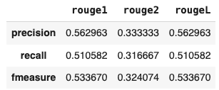

# Testing LLMs

## Rourge (Recall-Oriented Understudy for Gisting Evaluation)

### How the score is calculated?

we can use unigrams , bigrams or n-grams fot this calculation. The following is an example with unigrams:

```
Rouge-1 Recall = unigram matches / unigrams in expected text

Rouge-1 Precision = unigram matches / unigrams in llm response

Rouge-1 fmeasure = 2 x (precision x recall) / (precision + recall)

```

We used Google Search [Google Search](https://github.com/google-research/google-research/) library to do the calculations.

### Run the tests:

```
python -m unittest backend/ml_models/modules/tests/ml_models_test.py 
```

### How test the LLMs:

```
model_tester = ModelTester(test_texts, gen_texts)

# Calculate ROUGE scores
model_tester.calculate_rouge_score()

# See results as DataFrame
import pandas as pd
scores = pd.DataFrame(model_tester.test_results)
scores
```

You should see something like this:


